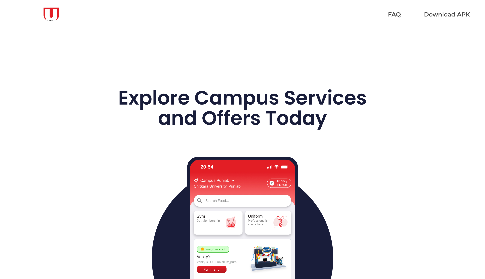
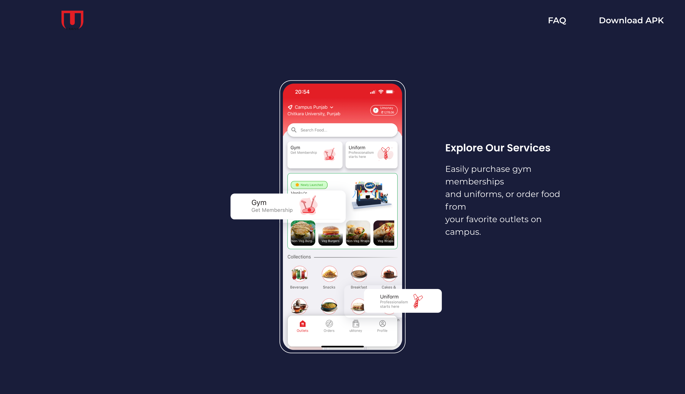
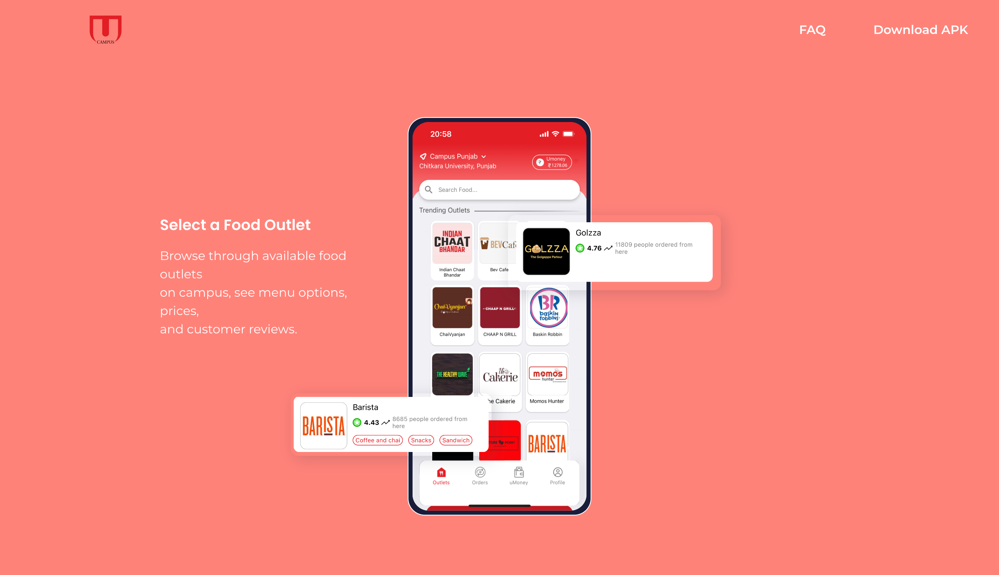
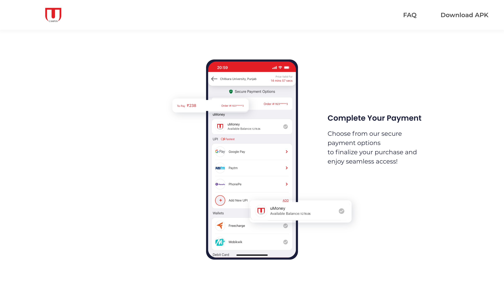

# 🏫 Ucampus-Infosite

Welcome to the **Ucampus-Infosite**! This website serves as a comprehensive hub for our college app, providing essential information and easy access to download options. 🌟

---

## 📖 Table of Contents
- [🌟 Features](#-features)
- [💻 Technologies Used](#-technologies-used)
- [📸 Screenshots](#-screenshots)
- [🛠️ Installation](#-installation)
- [🔗 Links](#-links)
- [📞 Contact](#-contact)

---

## 🌟 Features
- **Information Hub**: Get all the latest updates and details about the Ucampus app, including food ordering, gym memberships, and uniforms.
- **Download Section**: Easily download the app with a single click! 📲
- **User-Friendly Interface**: A clean and intuitive design for effortless navigation. ✨
- **Interactive Animations**: Enhanced user experience with animations using [GSAP](https://greensock.com/gsap/) (GreenSock Animation Platform). 🚀
- **Responsive Design**: Works seamlessly on both mobile and desktop devices. 📱💻
- **Community Updates**: Stay informed with announcements and events happening around campus! 🗞️

---

## 💻 Technologies Used
- **React**: A JavaScript library for building user interfaces.
- **GSAP**: For smooth and powerful animations.
- **HTML/CSS**: For structuring and styling the website.
- **JavaScript**: For interactive features and functionality.

---

## 📸 Screenshots

<div style="text-align: center; font-size: 24px;">
    <h1>Homepage of Ucampus-Infosite</h1>
      
    <br>
    <h2>Explore section of the Ucampus app</h2>
      
    <br>
    <h2>Food outlet details in the Ucampus app</h2>
      
    <br>
    <h2>Payment section of the Ucampus app</h2>
      
    <br>
    <h2>Overview of available outlets</h2>
      
    <br>
</div>

## 🛠️ Installation
Follow these simple steps to set up the project on your local machine:

1. **Clone the repository**:
   ```bash
   git clone https://github.com/Anuj-er/Ucampus-Infosite.git
   ```
2. **Navigate to the project directory**:
   ```bash
   cd Ucampus-Infosite
   ```
3. **Install dependencies**:
   ```bash
   npm install
   ```
4. **Start the development server**:
   ```bash
   npm start
   ```

---

## 🔗 Links
- [GitHub Repository](https://github.com/Anuj-er/Ucampus-Infosite)
- [Live Demo](https://ucampus.vercel.app)

---

## 📞 Contact
For inquiries, feel free to reach out to:
- **Anuj Kumar**: [anujsiwachjaat@icloud.com](mailto:anujsiwachjaat@icloud.com)

---

Thank you for visiting the Ucampus-Infosite! We hope you find it useful. 😊
